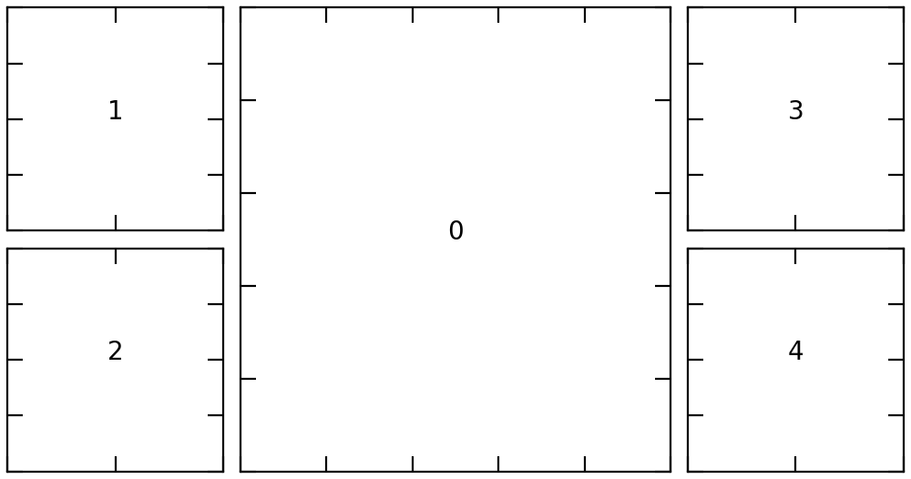

# squaregrid
Wrapper of matplotlib's GridSpec module which allows for the easy spawning of several different of configurations of square plots of varying sizes.

## Basic Usage 
SquareGrid has a few plotting styles that you can access. These are 
- TriGrid: One primary panel with two minor panels. Minor panels can be located to the left, top, bottom, or right. 
- QuadGrid: One primary panel with three minor panels (same positioning arguments as TriGrid)
- QuintGrid: One primary panel with four minor panels. Can be placed left, right, or center. 
- LGrid: One primary plot with 5 minor panels, arranged in an "L" shape around the primary. (Position primary in upper left/right, bottom left/right)
- UGrid: One primary with 7 minor panels, arranged in a U shape or n shape around the primary. 



## Initialization 

After importing `squaregrid.SquareGrid`, you can initilize a plot by calling the class and specififying a figure width:
```
sg = SquareGrid(figure_width=5)
```
Because of this module's obsession with square panels, the figure width also constrains the figure height, which is automatically calculated in order to maintain square panels. 

Next, you can run any of the methods above to generate your figure and axes: 
```
fig, axes = sg.QuintGrid(primary='middle')
```
The figure and axis object returned by this method are free for you to interact with as you normally wood -- plotting them immediately will show the orientation of the subplots with respect to each other. The `SquareGrid` object also retains a copy of the empty figure axes which can be useful. 

## TriGrid, QuantGrid, QuintGrid
The primary adjustable parameter for these methods is `primary`, which determines where the large plot sits in relation to the smaller plots. For `TriGrid` and `QuantGrid`, the options for primary are: 
- `'left'`: Main plot is left, stack of 2 (or 3) smaller plots to the right.
- `'right'`: Main plot is right, stack of 2 (or 3) smaller plots to the left. 
- `'top'`: Main plot is top, 2 (or 3) plots across the bottom. 
- `'bottom'`: Main plot is bottom, 2 (or 3) plots across the top. 

For `QuintGrid`, the options are 
- `left'`: Main plot is left, square of 4 plots to the right.
- `'right'`: Main plot is right, square of 4 plots to the left.
- `'middle'`: Main plot center, with stack of 2 vertical plots on left and two on right. 

## LGrid and Ugrid 
The two most panel dense options are `LGrid` and `Ugrid`. As their names imply, these form an L shape or U shape of smaller panels around a main figure.

For `LGrid`, the main argument is `pos`, which sets the position of the main panel. Options are 
- `'upper_left'` (or `'ul'`): Main figure upper left, wrapped on bottom and right. 
- `'upper_right'` (or `'ur'`): Main figure upper right, wrapped on bottom and left. 
- `'lower_right'` (or `'lr'`): Main figure lower right, wrapped on top and left. 
- `'lower_left'` (or `'ll'`): Main figure lower left, wrapped on top and right. 

For `UGrid`, the main argument is `orientation` which sets whether the wrap of small panels wraps above or below the primary figure. 
- `'up'`: "U" shape in the small panels, wrapping below the main panel. 
- `'down'`: "n" shape in the small panels, wrapping above the main panel. 

## Helper keywords 
Each of the `SquareGrid` methods comes with a few helper keywords. 
- `hidelabels (default True)`: Suppress the numerical labels on axes. 
- `show_indices (default False)`: If true, the ax index of the plot is shown in the center of the plot. The primary plot is always index 0. After this, it tends to follow a natural left-right, wrap following order. 


